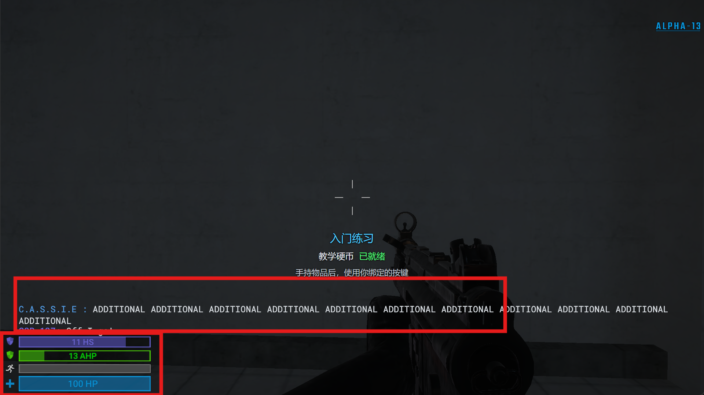
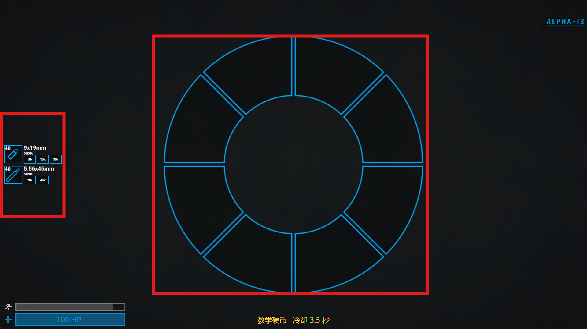

# HSM 界面与样式指南

本课程使用 [HSM 源码分支](https://github.com/sl-plugins-cement/HintServiceMeow)。构建版本由 `dependencies.json` 锁定。

本页把 **HSM 接口行为**、**实测定位约束** 与 **本课程设计约定** 分开说明。
颜色、字号和教学位置是可调整的设计选择；不能把示例坐标当成所有插件共同占用的固定位置。

## 先选择信息类型

| 类型 | 内容 | 更新与结束 |
| --- | --- | --- |
| 状态 | 当前物品、是否就绪 | 状态改变时改文字，离开状态时移除 |
| 冷却 | 名称、剩余秒数 | 本示例每 0.25 秒检查，文字相同时不更新 Hint |
| 短通知 | 一个事件及结果 | 明确到期时间；重复事件更新原条目 |
| 物品说明 | 名称、用途、操作 | 仅在相关物品/场景显示；避免长期遮住准星 |

## 界面样式约定

| 用途 | 建议颜色 | 文案示例 |
| --- | --- | --- |
| 标题与重点 | `#4FCBFF` | `入门练习` |
| 正文/数值 | `#E7ECF3` | `教学硬币` |
| 次要说明 | `#C0C8D4` | `使用你绑定的按键` |
| 已就绪 | `#5BFF80` | `已就绪` |
| 等待/提醒 | `#FFD24D` | `冷却 3.5 秒` |
| 错误/危险 | `#FF6868` | `不可使用` |

- 状态同时用文字表达，不只靠红绿区分。
- 标题从 30 开始、正文 24、辅助说明 22；这些是教学起点。缩小窗口、明亮背景、中文字体都要检查。
- 每个条目只讲一件事。标题与正文分成独立 Hint，便于控制间距，避免多行混合字号互相挤压。
- 控制行长；长文改为多条短句。不要用很小的字塞满屏幕。
- 显示玩家昵称等外部文字前应过滤 `<`、`>`，避免把它们当成富文本标签。本例只使用固定文本。
- 中文和英文应分别布局测试，不把双语同时塞进同一条提示。本入门课程使用中文。
- 按键文案写“你绑定的按键”；建议 V 不等于玩家实际绑定了 V。

## 坐标与换行：实测约束

按 1920×1080 虚拟画布理解：Y 越大越靠下。使用 `Center` 对齐并显式指定 X，垂直锚点使用 `Middle` 或 `Top`。
当前校准下，行中心横坐标约为 `960 + X / 2`。**这是目标客户端的实测关系，不是 HSM 对所有未来版本的保证。**

自动换行需要检查光标区间 `X .. X + 行宽`，不能只看最终渲染出来的包围盒。
现有保守测试区间是 `X >= -800` 且 `X + 行宽 <= 1100`。
`<nobr>` 不能作为消除换行风险的保证；透明空格也有宽度。
本课统一 `X=0`、短行、居中布局。不要直接改成 HSM `Left`/`Right` 或 `Bottom`。
需要贴边 HUD 时单独做游戏内校准，不能从本课推导安全边缘坐标。

依据：维护工作区 `.tests/UI/src/preview-core.js` 的 2026-08-18 游戏内校准；本仓库在
`preview/preview-core.js` 保存该渲染模型的副本。预览只是排版近似，不模拟完整 Unity/TMP 渲染。

## 多插件共存

每个插件维护自己的区域表，安装组合的维护者负责协调重叠。示例画廊暂用 Y=650/700/745，物品冷却用 Y=1050。
画廊是管理员主动打开的临时排版展示，打开背包时会与原生轮盘重叠；查看画廊前关闭背包。
这三个位置不适合直接作为常驻 HUD。常驻冷却放在背包轮盘下方，仍需检查目标服务器的其他插件。
这些位置**没有在真实服务器插件组合中预留**，安装到个人测试服即可，不应直接放入生产组合。
检查背包打开、观战、角色技能、血量栏和其他插件提示；不要只在黑底截图上验收。

每个玩家复用稳定 ID，例如 `cement.foundations.cooldown`，并使用独立分组 `cement.foundations`。
只清理自己创建的条目。示例保存 Hint 对象，用同一个对象与分组调用 `RemoveHint`。
`AddHint`、`RemoveHint` 的行为依据：HSM `Core/Utilities/PlayerDisplay.cs`；可修改属性依据：
`Core/Models/Hints/Hint.cs` 和 `AbstractHint.cs`。

## 可选依赖与生命周期

业务代码面向 `IHintDisplayProvider`；HSM 可用时使用 `HsmHints`，缺失或签名不兼容时用空实现。
所有反射集中在适配器中。不要在每个技能里复制反射，也不要在缺失时自动改用原生全屏提示。
此教学适配器在启用时探测依赖；安装/更换 HSM 后重启测试服。

- 画廊 12 秒后到期，手持物品提示在真实脱手后消失。
- 角色变化、断线、回合重置和插件关闭都清理本插件的提示。
- 切换显示模式时清掉上一种模式；同一模式下复用 Hint，不循环新建。
- 教学 HUD 开关只控制显示，不修改物品能力和冷却。

## 预览与验收

下载仓库后打开 `preview/index.html`，选择画廊、冷却或短通知。也可以加载自己选择的游戏截图作为背景；背景不会上传。
`preview/styles.json` 是预览输入，`preview/styles.js` 是直接打开 HTML 时使用的同一数据。
示例的画廊与冷却文字应与 `examples/Foundations/Plugin.cs` 一起维护。

此图是预览器渲染，**不是本次示例的游戏内验收截图**。最终按 [验收清单](../tests/foundations-verification.md) 检查。

图中的红框来自测试背景，标记需要避让的原生 UI，不是插件绘制的边框。
